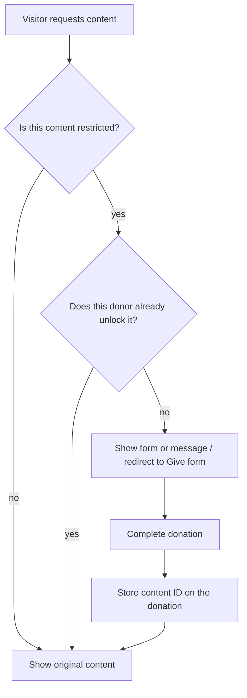

# Donate to Access Content

[](https://www.gnu.org/licenses/gpl-3.0)

Unofficial [GiveWP](https://wordpress.org/plugins/give/) add-on that hides selected WordPress content until a visitor completes a qualifying donation.

This repository is the development source (uncompiled PHP, SCSS, and JavaScript). Install a built copy from [WordPress.org](https://wordpress.org/plugins/cip-dtac-for-give/) or a [GitHub release](https://github.com/contriveitup/give-add-on-donate-to-access-content/releases) unless you intend to compile assets yourself.

| | |
| --- | --- |
| Plugin name | Give Addon - Donate To Access Content |
| Version | 3.0.0 |
| Requires at least | WordPress 6.0, PHP 8.1, [GiveWP](https://wordpress.org/plugins/give/) |
| Tested up to | WordPress 7.1, GiveWP 4.16.x |
| Text domain | `dtac-give` |
| Settings | **Settings → DTAC** |
| License | [GPLv3 or later](LICENSE) |

## What it does

Site owners pick content that guests cannot view until they donate through a Give form. After a completed donation, the plugin records which content that donor unlocked. Later visits by the same donor (logged-in Give donor, session email, or restored guest cookie) show the original content.

You can restrict:

- Individual **pages** and **posts** (settings lists or a per-post metabox)
- **Category** and **custom taxonomy** archive pages
- Entire public **custom post types**
- A **portion of a page** via shortcode or block (the rest of the page stays public)

Guests who have not donated see either an embedded Give form or a custom message with a link to donate. Restricted URLs send `Cache-Control` / `nocache` headers so page caches do not store gated HTML.

This plugin is **not** an official GiveWP product.

## Requirements

- WordPress 6.0 or later
- PHP 8.1 or later
- GiveWP active (legacy v2 forms and visual-builder v3 / v4 forms are both supported)
- A published Give donation form to use as the default gate

If 3.0.0 is installed or updated on PHP older than 8.1 (WordPress still loads an already-active plugin), the bootstrap shows an admin notice and deactivates the plugin instead of fatalling on 8.1 syntax. Upgrade PHP, then activate the plugin again.

## How it works



1. **Restriction** — Settings lists, the **Restrict with donation** metabox, the `[cip_donate_to_access_content]` shortcode, or the Restricted Content block mark content as gated.
2. **Gate** — Guests are redirected to the chosen Give form (full page / archive) or see the form / message inline (shortcode and block). The plugin remembers which content they were trying to open (`dtac_give_content` on the form URL, plus a short-lived pending-content cookie for visual-builder forms).
3. **Grant** — On a completed donation (`give_complete_donation` for legacy forms, `givewp_donation_created` / `givewp_donation_form_processing_donation_created` for visual-builder forms), the plugin stores the content ID on the donation as `_dtac_give_access_to_content`. Only IDs that pass a whitelist (`dtac_give_is_grantable_content_id`) are saved, so a crafted query string cannot unlock arbitrary posts.
4. **Reuse** — Later visits look up the Give donor (WordPress user ID when logged in, otherwise session / guest-access email) and compare unlocked IDs. Optional **minimum amount** and **expiry in days** can still deny access even if a donation exists.
5. **Restore** — Guests who donated on another device can request a signed email link (**Already donated?**) that restores access for 30 days via cookie.

### Content IDs

Unlock records use a small identifier vocabulary:

| ID | Meaning |
| --- | --- |
| `123` | Page, post, or other public post ID |
| `c8` | Category or custom-taxonomy term ID `8` |
| `dtac_book` | Public custom post type slug (every singular of that type) |
| `site` | Whole-site unlock (only if that legacy option is already stored) |

### Who is still blocked

Access is based on **Give donors**, not WordPress login. A logged-in subscriber without a matching donor record still sees the gate. Give form pages themselves are never treated as restricted content.

### Category archives vs single posts

Restricting a **category** (or custom taxonomy) gates the **archive**. A single post in that category remains publicly viewable on the front end unless you also restrict that post (settings list, metabox, shortcode, or block).

Feeds, REST, search, and oEmbed use a separate leak filter and may still hide or excerpt that post when leak mode is **Hide completely**. Use **Show excerpt only** if you want teasers on those surfaces.

## Setup

1. Install and activate [GiveWP](https://wordpress.org/plugins/give/) and this plugin.
2. Create at least one donation form.
3. Open **Settings → DTAC**.
4. Choose the default **Give Donation Form ID**.
5. Select **Restrict Access To?** (`Pages`, `Posts`, `Categories`, `Post Types`, `Custom Taxonomies`) and fill the matching lists.
6. Optionally set a global minimum donation, access expiry (days; `0` = never), leak mode, and the message shown when a shortcode/block uses `show="message"`.
7. For one-off posts, use the **Restrict with donation** metabox instead of (or in addition to) the global lists.

The donation form page is always reachable. **Allow Pages** keeps extra pages public when whole-site restriction is enabled from an existing stored option (that toggle is no longer shown in the settings UI; it was removed in 2.0.0 because it did not work reliably with Give iframe forms).

### Settings reference

| Setting | Purpose |
| --- | --- |
| Allow Pages | Pages that stay public if whole-site restriction is on. The default Give form page is always allowed. |
| Give Donation Form ID | Default form used for redirects and gates. Required. |
| Restrict Content Message | HTML shown when a shortcode or block uses `show="message"`. Placeholder `%%donation_form_url%%` becomes a link to the form (with the current content ID attached). |
| Restrict Access To? | Which restriction lists are active. |
| Restrict Pages / Posts | Specific published pages or posts. |
| Restrict Custom Post Types | Public CPT slugs. Every singular of those types is gated. |
| Restrict Categories / Custom Taxonomies | Term IDs. Gates those **archives**. |
| Minimum donation amount | Global floor. Donations below it do not unlock. Per-post metabox overrides when set. |
| Access expires after (days) | Global TTL from the donation timestamp. `0` = never. Per-post metabox overrides when set. |
| Restricted content in feeds and APIs | `Hide completely` or `Show excerpt only` for REST, RSS/Atom, search, and oEmbed. |

Settings are stored in the `dtac_give_settings` option. Existing list keys are unchanged in 3.0.0 so upgrades keep their restriction selections.

### Per-post metabox

On public post types (except Give forms and attachments) the side metabox **Restrict with donation** offers:

- **Restrict this content** — Inherit from settings (default), Yes, or No
- **Give donation form** — Override the default form, or keep “Use default form”
- **Minimum donation amount** — Override the global minimum
- **Access expires after (days)** — Empty inherits global; `0` never expires

**No** opts that post out of settings-list restriction.

## Shortcodes

### Restrict a section of content

```
[cip_donate_to_access_content form_id="1" show="form"]
Secret content for donors.
[/cip_donate_to_access_content]
```

| Attribute | Required | Values | Default |
| --- | --- | --- | --- |
| `form_id` | Yes | Give form ID | — (shortcode outputs nothing without it) |
| `show` | No | `form` or `message` | `form` |

`form` embeds `[give_form]`. `message` prints the Restrict Content Message, with `%%donation_form_url%%` replaced by a link to that form. An **Already donated?** restore form is appended in both cases.

The enclosing post ID is what gets granted after donation, so one shortcode gates that whole post’s shortcode body (not an independent inner ID).

### List what the current donor unlocked

```
[dtac_my_unlocked_content]
```

Renders a list of labels and permalinks for content IDs stored on that donor’s completed donations. Guests without a matching donor see “No unlocked content found.”

## Blocks

In the block inserter (Widgets category):

| Block | Name | Editor controls |
| --- | --- | --- |
| Restricted Content | `dtac/restricted-content` | Give form ID, show **Donation form** or **Restriction message**. Inner blocks are the gated content. |
| My Unlocked Content | `dtac/my-unlocked-content` | None. Dynamic list, same output as the shortcode. |

## Guest restore

On gated output the plugin prints **Already donated?** Ask the visitor for the email used on the donation. If that address has qualifying unlocks, WordPress mails a signed link (`dtac_give_restore`) that expires in one hour. Opening it sets an HttpOnly guest-access cookie (30 days) so the donor is recognized without a WordPress account.

The email copy is intentionally vague if the address has no donations (no account enumeration).

## GiveWP 2.x vs 3.x / 4.x forms

- **Legacy (v2) forms** receive hidden fields `dtac_give_content` and `dtac_give_process_donate_to_access` at the top of the donation form. Completion is handled on `give_complete_donation`.
- **Visual builder (v3 / v4) forms** cannot take those hidden inputs the same way. The plugin puts `dtac_give_content` on the donation-form URL and stores it in a pending-content cookie before submit, then grants on GiveWP donation-created actions.

Use a real Give form ID from **Donations → All Forms**. Test both form builders if your site still has mixed v2 and v3 forms.

## Admin extras

- Donations list: **Unlocked Content** column (Give payments table).
- Settings screen: grouped sections, **Unlock insights** table counting grants per content ID, and a themediaable cross-sell for [Signals Dispatch for WooCommerce](https://wordpress.org/plugins/signals-dispatch-for-woocommerce/).
- Uninstalling the plugin deletes `dtac_give_settings` (and the network option on multisite) plus related post/donation/donor meta (`_dtac_give_access_to_content`, `_dtac_give_restrict`, `_dtac_give_form_id`, `_dtac_give_min_amount`, `_dtac_give_expiry_days`, `give_dtca_access_website`).

## Install from WordPress.org

1. **Plugins → Add New** and search for *Donate to Access Content*, or install the zip from [wordpress.org/plugins/cip-dtac-for-give](https://wordpress.org/plugins/cip-dtac-for-give/).
2. Activate GiveWP first, then this plugin.
3. Configure **Settings → DTAC**.

## Develop from this repository

Compiled CSS/JS live in `assets/` (gitignored). WordPress.org / release zips already contain the build.

```bash
git clone https://github.com/contriveitup/give-add-on-donate-to-access-content.git
cd give-add-on-donate-to-access-content
composer install
npm install
npm run deploy
```

| Command | What it does |
| --- | --- |
| `npm run deploy` | Build CSS (Sass + Autoprefixer) and transpile `assets-src/js` → `assets/js` |
| `npm start` | Watch Sass and Babel |
| `composer test` | PHPUnit (`phpunit.xml`, suite in `tests/`) |
| `composer phpcs` | WordPress Coding Standards (PHP 8.1+, WP 6.0+) |
| `composer phpcbf` | Auto-fix PHPCS where possible |

PHP namespace is `DTAC\` (PSR-4 from `src/`). Shared helpers live in `includes/functions.php`. GiveWP API calls go through `DTAC\Give\Give_Adapter` so missing or older Give versions fail softly.

### Layout

```
cip-give-donate-to-access-content.php   Bootstrap, Give dependency check
includes/                               Shared helpers (restriction, grants, content IDs)
src/Admin/                              Settings, metabox, insights, themediaable cross-sell
src/Frontend/                           Redirects, shortcodes, blocks, leak filters, magic link
src/Give/                               GiveWP adapter
src/Controllers/                        Settings form field renderers
assets-src/                             SCSS and block JS (compile with npm)
tests/                                  PHPUnit
uninstall.php                           Data removal on plugin delete
```

### Hooks

Every extension point is documented in [docs/HOOKS.md](docs/HOOKS.md): restriction
decisions, grant and expiry rules, gate markup, redirects, guest-restore emails,
leak protection, shortcode and block output, and settings. All hooks are prefixed
`dtac_give_`.

## Frequently asked questions

**Is this an official Give add-on?**
No. It depends on GiveWP but is maintained independently.

**What can I restrict?**
Pages, posts, category archives, custom post types, custom taxonomy archives, and inline sections via shortcode or block.

**A category is restricted. Can visitors still open a post in that category?**
Yes on the front end, unless that post is also restricted. The category setting gates the archive. Leak protection may still hide or excerpt the post in REST, feeds, search, and oEmbed depending on leak mode.

**Do I have to use the shortcode?**
No. Settings lists and the metabox restrict entire URLs (redirect to the donation form). Use the shortcode or Restricted Content block when only part of a page should be gated.

**Can guests recover access after clearing cookies?**
Yes. Use **Already donated?** with the donation email, then open the signed link.

**Will a tiny donation unlock paid content?**
Not if you set **Minimum donation amount** globally or on the metabox. The donation must meet or exceed that amount.

**Does access last forever?**
By default yes (`0` days). Set expiry globally or per post to require a newer donation.

**What happens if the site is still on PHP 7.4 or 8.0 after updating to 3.0?**
The plugin deactivates itself and shows an admin error. It does not load the 8.1+ classes, so the rest of WordPress keeps running. Upgrade to PHP 8.1 or later, then activate the plugin again.

**What happens to data if I delete the plugin?**
Uninstall removes plugin settings and the meta keys listed under [Admin extras](#admin-extras). Give donations themselves are not deleted.

## Changelog (3.0.0)

Highlights from 3.0.0 (26 August 2026):

- GiveWP 3.x / 4.x visual-builder grant path alongside legacy v2 forms
- Per-post metabox (restrict, form, minimum, expiry)
- Blocks `dtac/restricted-content` and `dtac/my-unlocked-content`
- Guest restore via signed email and `[dtac_my_unlocked_content]`
- REST, feed, search, and oEmbed leak protection
- Donations-list Unlocked Content column and settings unlock counts
- Content-ID whitelist against grant spoofing
- Cache headers on restricted URLs
- Requires WordPress 6.0+, PHP 8.1+; tested up to WordPress 7.1 and GiveWP 4.16.x

Full history: [README.txt](README.txt) (WordPress.org readme) and [changelog.txt](changelog.txt).

## Support

- Bugs and features: [GitHub issues](https://github.com/contriveitup/give-add-on-donate-to-access-content/issues)
- WordPress.org listing: [cip-dtac-for-give](https://wordpress.org/plugins/cip-dtac-for-give/)

## License

[GNU General Public License v3.0 or later](LICENSE).

